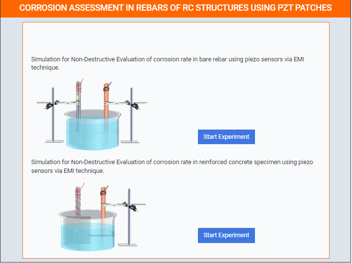
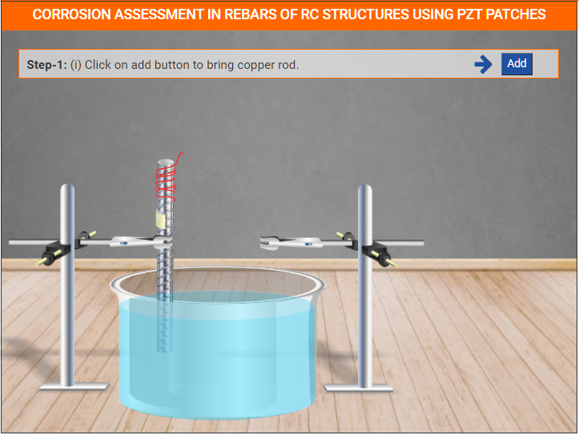

### Thsese steps will be followed for the experiemnt
**Select First One Experiment**
 

  

**Step 1**
 
(a) Click on Add Button to bring Empty Tank. 
(b) Click on Tank to Place it on the position. 

(C) Click on Add Button to bring Brine Solution.

(d) Click on Brine Solution to pour it into the Tank.

(e) Click on Add Button to bring Bare Rebar Holder.

(f) Click on Add Button to bring Bare Rebar.
(g) Click on Bare Rebar to fix it on the Bare Rebar Holder.

(h) Click on Add Button to bring Copper Rod Holder.

(i) Click on Add Button to bring Copper Rod.
(j) Click on Copper Rod to fix it on the Copper Rod Holder.

(k) Now click on Next Button.

**Step 2**

(a) Click on Black Clip to attach wire with Copper Rod.
(b) Click on Red Clip to attach wire with Bare Rebar.

(c) Now click on Next Button.

**Step 3**
(a) show the Condition of RC Specimen.

**Step 4**
(a) Condition of concrete cube and rebar after splitting.

**Step 5**
(a) Select Option and Download Report.

