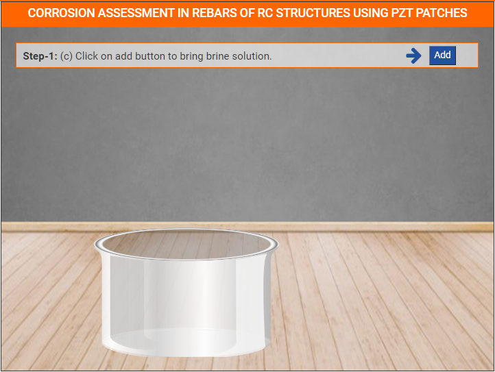
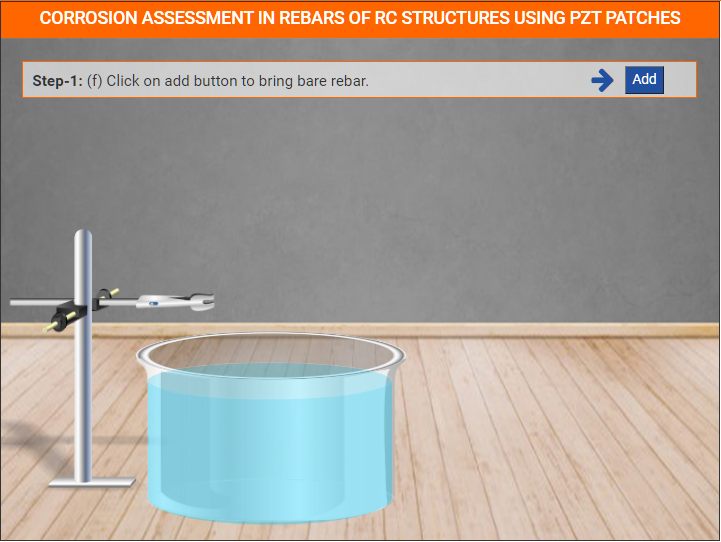
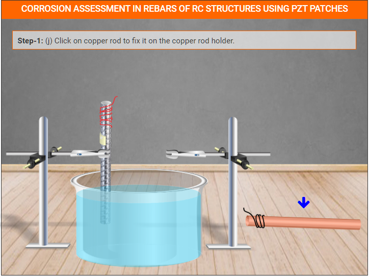

### These steps will be followed for the experiemnt

<!-- **PRE EXPERIMENT TASK**

1) What is non-destructive evaluation (NDE)? 
2) What is structure health monitoring (SHM) and why it is necessary to
do SHM? 
3) What is EMI technique and piezo sensors? 
4) What is the mechanism of chloride induced corrosion? 
5) What components are needed for accelerating corrosion in laboratory?  -->

**Select experiment for bare rebar**
 

  

**Step 1**

(a) Click on add button to bring empty tank.

(b) Click on tank to place it on the position.

(C) Click on add button to bring brine solution.

(d) Click on brine solution to pour it into the tank.

(e) Click on add button to bring bare rebar holder.

(f) Click on add button to bring bare rebar.

(g) Click on bare rebar to fix it on the bare rebar holder.

(h) Click on add button to bring copper rod holder.

(i) Click on add button to bring copper rod.

(j) Click on copper rod to fix it on the copper rod holder.

(k) Now click on next button.

**Step 2**

(a) Click on black clip to attach wire with copper rod.

(b) Click on red clip to attach wire with bare rebar.

(c) Now click on next button.

**Step 3**
(a) Show the condition of RC specimen.

**Step 4**
(a) Condition of concrete cube and rebar after splitting.

**Step 5**
(a) Select option and download report.

<!-- **POST EXPERIMENT TASK**

1) Plot graph comparing signatures for pristine and corroded bare and
embedded rebars? 
2) Obtain root mean square deviation (RMSD) of signatures for bare and
embedded rebars in pristine and corroded conditions? 
3) How can the results of laboratory tests be applied to real field?  -->
