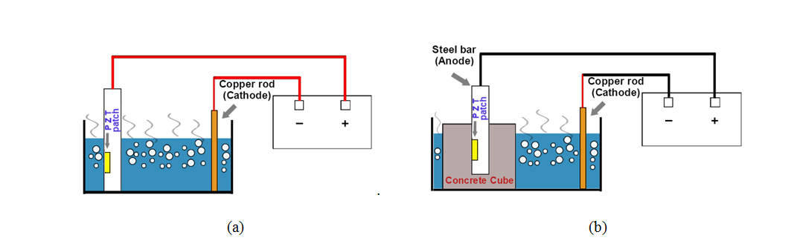

### Introduction

Corrosion of steel reinforcement is one of the main causes of damage and premature failure of reinforced concrete structures, increasing the costs for inspection, maintenance, restoration, and replacement of infrastructure. Recently, Talakokula and Bhalla (2015) proposed a new corrosion assessment approach based on the mechanical impedance EMI technique (Refer thesis of Dr. Vislalakshi Talakokula. 
Figures 1(a) and (b) present the experimental setup for the rebar corrosion related laboratory experiments for bare rebar and embedded rebar respectively.  

Figure 1: Data acquisition setup for accelerated corrosion in (a) bare rebar (b) embedded rebar

**EXPERIMENTAL DETAILS**
 
In the accelerated corrosion experiments of bare rebar, following components are used:
- Copper rod acting as Cathode.
- Bare rebar acting as Anode.
- PZT bonded to rebar which is further connected to LCR meter by electrodes.
- Beaker containing brine solution whose salinity is 35 parts per thousand.

For accelerated corrosion experiments in embedded rebars, the components are same except that a 150 x 150 x 150 mm concrete cube with an embedded bar replaces the bare rebar the setup for accelerating corrosion for bare rebar and reinforced concrete is shown in Figure 2(a) and (b) respectively.

**EXPERIMENTAL PROCEDURE**
 
The setup for accelerating corrosion for bare rebar and reinforced concrete is shown in Figure 2(a) and (b) respectively.
Through this animation, the user can visualize the process of accelerated corrosion and can obtain signatures of the PZT patch bonded to rebar during various stages.  Figure 2 shows a screenshot of the animation.
The user can visualize the data in by plotting in excel and study the changes in signature with increasing corrosion.

Where 
Gi0 = Baseline conductance value at ith frequency 
Gi1 = Conductance value after damage at ith frequency 
n = No. of frequency data points 

As an exercise plot a histogram of RMSD for the various damaged states. Note your observations and draw conclusions
